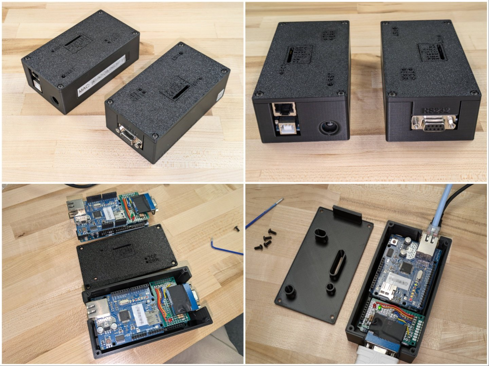

# Enclosure for UART-over-Ethernet Device
This directory is for a simple 3D printable enclosure I designed to house an Arduino Mega 2560, W5100 Ethernet shield, and perf board with a MAX3232 RS232 transceiver and status LEDs. The enclosure is assembled with 4x M3x8mm screws.

## Grabdcad File Credits:
The following models where used to help with the enclosure design.
- Arduino Mega 2560 (https://grabcad.com/library/arduino-mega-2560-8)
- W5100 Shield (https://grabcad.com/library/ethernet-shield-arduino-1)
- RS232 TO TTL Serial Converter (https://grabcad.com/library/rs232-to-ttl-serial-converter-1)