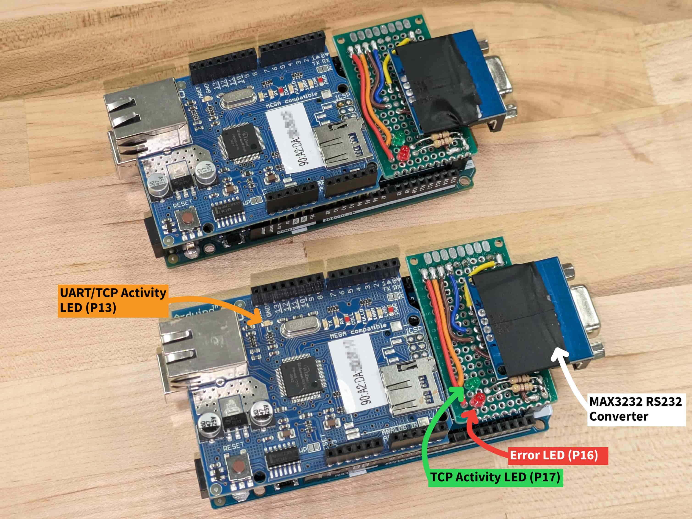

# UART-over-Ethernet-v2

This project turns two Arduino Mega 2560 + W5100 shield nodes into a transparent UART-over-TCP bridge. All UART data on `Serial1` is framed and sent over TCP, and incoming TCP frames are forwarded to `Serial1`. The bridge includes heartbeat monitoring, reconnect backoff, CLI configuration over USB serial, and EEPROM config storage.

While it would be better to use a more performant MCU and Ethernet controller for higher baud rate support and reliability, at the time of writing, we needed a solution now and had these components on hand. For more info, review [Serial buffering, blocking, and reliability](#serial-buffering-blocking-and-reliability) below. In the future, if we need better performance, I plan to move to a WT32-ETH01, ESP32-P4-ETH, or ESP32-S3-ETH dev board.



## Features
- Transparent serial bridge: Serial data sent to the Serial1 port on one board is delivered to the Serial1 port on the other, and vice versa. Supports baud rates up to 19.2k bps and NUL bytes in the data stream. Review the [Serial buffering, blocking, and reliability](#serial-buffering-blocking-and-reliability) section below for details on performance and reliability.
- Handles connection loss and automatic reconnection.
- Buffers and transmits data line-by-line (on \<CR>, \<LF>, or both) or after a short idle timeout to optimize throughput on streams without line breaks.
- Configuration and debug output on USB Serial for monitoring and troubleshooting.

## How it works
- Startup loads config from EEPROM (magic check, otherwise defaults).
- Initializes Serial0 (115200) for CLI and debug, Serial1 for UART data.
- Ethernet is initialized with local MAC/IP and remote IP.
- Server mode: listens on configured TCP port and accepts one client connection.
- Client mode: connects to remote IP/port and retries with exponential backoff.
- Data from Serial1 is buffered, framed (`[D|H][len][payload]`), and sent over TCP.
- TCP data is parsed by a simple state machine and forwarded to Serial1.
- Heartbeats are sent and expected; missing several causes reconnect.
- Modifiable status LEDs using built-in (pin 13) for UART/TCP activity, pin 17 for TCP connection status, and pin 16 for errors.
   - `PIN_LED_CONNECT` (P17) - Blink = TCP Connecting, Solid = TCP Connected
   - `PIN_LED_ERROR` (P16) - On = Error within the last 10 seconds.
   - `PIN_LED_ACTIVITY` (LED_BUILTIN) - Flashes on Serial1 or TCP Activity.
- WDT enabled (4s)

## Hardware Requirements
- 2x Arduino Mega 2560 (one SERVER, one CLIENT)
- 2x W5100 Ethernet Shield (or other W5100 device)
- Any UART devices to connect to `Serial1` (e.g., RS232/RS485 transceivers, PLCs, etc.)

## CLI commands and config
Connect to the device over USB at **115200** baud to configure.
**Supported commands:**
- `status` - print current settings and runtime stats
- `set role <server|client>`
- `set ip <x.x.x.x>`
- `set remote <x.x.x.x>`
- `set mac <XX:XX:XX:XX:XX:XX>`
- `set port <N>`
- `set baud <1200|2400|4800|9600|14400|19200>`
- `set hbinterval <1..60>`
- `save` - save config to EEPROM and reboot
- `defaults` - reset to defaults and reboot
- `reboot` - immediate reboot
- `clearerrors` - reset error/reconnect counters
- `set debug <on|off>` - toggle debug output

## Usage
1. Configure one board as SERVER (`set role server`) and one as CLIENT (`set role client`)
   1. NOTE: The devices must be on the same subnet, currently assumes a /24 subnet.
2. Set the IP address for each board (e.g., on SERVER `set ip 192.168.1.100`)
3. Set the remote IP address on each board to point to the other (e.g., on SERVER `set remote 192.168.1.101`)
4. Set the same port and baud rate on both boards (e.g., `set port 3000`, `set baud 9600`).
5. Use `save` to write changes to EEPROM.
6. Attach UART devices to `Serial1` (e.g., RS232 sensors/PLC).


## VSCodium IDE Setup
To set up any VSCodium IDE for this project, you will need to install the following extensions:
- `PlatformIO IDE`
- `clangd`
- `CodeLLDB`

After installing the extensions, you should disable the Microsoft C/C++ extension's IntelliSense to fix conflicts with clangd. You can do this by adding the following to your user settings (`settings.json`):
```json
"C_Cpp.intelliSenseEngine": "disabled"
```

To get `clangd` working properly with IntelliSense and generate the `compile_commands.json` file, launch the PIO CLI and run the following commands:
```bash
pio init --ide vscode
pio run -t compiledb
```

## Serial buffering, blocking, and reliability
- In `platformio.ini` we use a build flag `-DSERIAL_RX_BUFFER_SIZE=1024` which increases the Arduino core software RX ring buffer for serial ports to 1024 bytes (from the default 64). This allows more incoming data to be buffered during blocking operations to avoid data loss.
- During many blocking Ethernet waits (for example `connect()` polling), UART ISRs still run and continue storing bytes into the RX ring buffer.
- Data is lost only if incoming bytes fill the RX ring buffer before the main loop drains it by sending over TCP.
- E.g., at 19.2k baud, a 1024-byte ring buffer fills in about 533.3 ms of continuous streaming data. Any blocking window longer than that can overflow Serial1 RX.
- Increasing the buffer gives more headroom, but consumes more RAM. If needed, you can adjust the buffer size in `platformio.ini` to balance between reliability and memory usage. However, keep RAM usage below ~70% to avoid instability.

The table below shows the time it takes to fill the RX buffer at different baud rates and buffer sizes, under worst-case continuous streaming data. If any operation blocks the main loop for longer than this duration, additional Serial1 data will be lost. This is only a real concern on unreliable networks or with very high baud rates or continuous streaming data. In practice, with a 1024 buffer and low baud rate, or sporadic serial traffic, the system should be adequate for most applications. If this is a concern, make sure to monitor the `UART Health` section of the `status` report for overruns and how close the buffer gets to full with `RX Buf Peak Used`.

| Baud | Time @64B | Time @256B | Time @1024B (default) |
|---:|---:|---:|---:|
| 1200 | 533.3 ms | 2133.3 ms | 8533.3 ms |
| 2400 | 266.7 ms | 1066.7 ms | 4266.7 ms |
| 4800 | 133.3 ms | 533.3 ms | 2133.3 ms |
| 9600 | 66.7 ms | 266.7 ms | 1066.7 ms |
| 14400 | 44.4 ms | 177.8 ms | 711.1 ms |
| 19200 | 33.3 ms | 133.3 ms | 533.3 ms |
| 38400 | 16.7 ms | 66.7 ms | 266.7 ms |


# To-do / Improvements
- [ ] Add CLI config options for subnet mask and gateway, currently assumes a /24 subnet
- [ ] Add DHCP option
- [ ] Add query packet to query the status report of the remote device.
- [ ] Log `uartRxBufPeakUsed` near full and `uartBufferOverflowCount` to debug serial immediately. 
- [ ] Break out certain features/functions/sections into separate files for better modularity and readability.
- [ ] Test 38.4k+ baud and if reliable, add as an option in the CLI.
- [ ] EEPROM offset for worn out cells? This project is for old hardware after all.

## License

GNU Affero General Public License v3.0 
